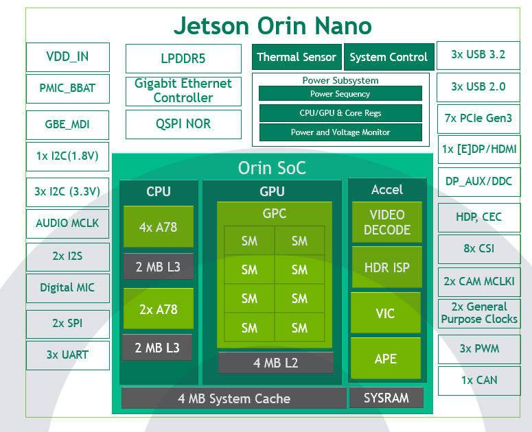
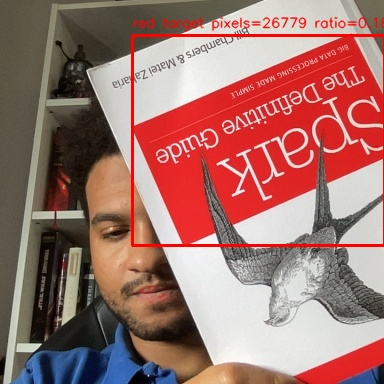
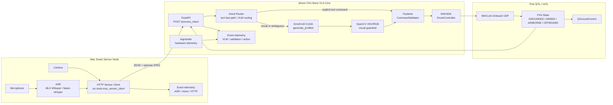

# Edge-VLA-Micro Architecture

## Executive Summary & Scope

Edge-VLA-Micro is a distributed Vision-Language-Action stack for PX4 autonomy experiments. It converts operator speech and optional camera evidence into validated MAVSDK commands through a Low-latency Voice-to-Action command loop. The project is designed for SITL/HITL development without requiring a physical drone during integration.

The engineering scope is Benchmarking and adapting VLMs for edge compute constraints (SWaP), then Bridging edge AI hardware (NVIDIA Jetson) with flight stacks (PX4/MAVLink). The Mac profile runs a research-class Qwen2-VL MLX backend for local spatial-reasoning validation; the Jetson profile runs a smaller SmolVLM CUDA backend to preserve bare-metal stability inside the Orin Nano 8GB Unified Memory Architecture budget.

The core system boundary is explicit:

- Perception proposes intent: ASR, optional camera capture, deterministic intent routing, VLM inference when needed, JSON extraction.
- Safety authorizes or rejects: Pydantic schemas, `CommandValidator`, OpenCV visual guardrails, PX4 state rules.
- Control executes only validated actions: MAVSDK arm, takeoff, hold, land, and velocity commands.

The VLM is not a control authority. Its output is treated as an untrusted proposal that must pass deterministic validation before reaching PX4.


Reference demo recording: [Open `vla-demo.mov`](docs/imgs/vla-demo.mov).

## Deployment Profiles

### Profile 1: Local Prototyping on Mac

The Mac-only profile runs the full stack on Apple Silicon:

- microphone capture and local ASR;
- OpenCV camera capture;
- MLX/MLX-VLM inference with Qwen2-VL;
- Pydantic validation and visual guardrails;
- MAVSDK command dispatch to PX4 SITL.

Use this profile for prompt iteration, regression testing, and quick end-to-end validation without the Jetson:

```bash
make run-local
```

Equivalent direct launcher:

```bash
./scripts/run_all_mac_agent.sh
```

This profile is not a Jetson capacity measurement. It uses Apple Silicon memory, MLX runtime behavior, and macOS camera/audio APIs.

Default research-class local VLM:

```text
mlx-community/Qwen2-VL-2B-Instruct-4bit
```

Override example:

```bash
COGNITION_MODEL=mlx-community/Qwen2-VL-2B-Instruct-4bit make run-local
```

### Profile 2: Distributed Edge

The distributed profile splits the system into two nodes.

Mac smart sensor node:

- records operator speech;
- runs local ASR with MLX Whisper or faster-whisper;
- captures a webcam frame only when visual grounding is required;
- sends text and optional JPEG image over HTTP.

Jetson Orin Nano VLA/control node:

- exposes `POST /process_intent` through FastAPI;
- runs `HuggingFaceTB/SmolVLM-256M-Instruct` on single-device CUDA;
- applies schema repair, HSV/RGB target guardrails, and `CommandValidator`;
- dispatches validated commands to PX4 through MAVSDK.

HTTP request shape:

```json
{
  "request_id": "uuid",
  "source": "mac_sensor_client",
  "text": "Move toward the red object.",
  "image_mime_type": "image/jpeg",
  "image_base64": "...",
  "metadata": {
    "sensor_node": "mac",
    "audio_ms": 1234.0,
    "vision_ms": 460.0,
    "image_present": true
  }
}
```

HTTP response shape:

```json
{
  "ok": true,
  "action": "move_velocity",
  "command": "move_velocity",
  "drone_state": {"operational_state": "OFFBOARD"},
  "timings_ms": {"cognition": 6400.0, "action": 20.0, "total": 6420.0},
  "vlm_profile": {"ttft_ms": 6100.0, "tps": 9.8, "safety_ms": 0.7}
}
```

Runtime entrypoints:

```bash
make run-sitl
make run-qgc
make run-edge-brain
make run-edge-sensor
make monitor-jetson
```

PX4 must route the onboard MAVLink stream to the Jetson:

```bash
mavlink stop -u 14580
mavlink start -x -u 14580 -r 4000000 -m onboard -o 14540 -t 192.168.55.1
```


The distributed profile is the primary edge architecture. It keeps camera and speech acquisition close to the operator while reserving Jetson UMA for SmolVLM, MAVSDK, PX4 telemetry, and monitoring.

This split is intentional: the Mac can execute larger VLMs such as Qwen for local validation, while the Jetson executes strongly constrained models such as SmolVLM to guarantee deployment without exceeding the 8GB UMA budget.


## Design Rationale

### HTTP Bridge

The HTTP bridge keeps ASR and camera acquisition on the Mac while keeping VLA inference and control on the Jetson. This split has three practical effects:

- the Jetson UMA budget is reserved for SmolVLM, FastAPI, OpenCV, MAVSDK, and the operating system;
- the Mac can use Apple-native ASR acceleration and stable camera access;
- the network boundary provides clean timing metrics for ASR, vision capture, HTTP round trip, VLM inference, safety validation, and action dispatch.

### ASR and Intent Routing Boundary

ASR is not a command authority. MLX Whisper or faster-whisper converts microphone audio into transcript text, and the downstream Jetson server treats that transcript as operator evidence. The current ASR path pins the language to English but does not pass a domain prompt or `initial_prompt` to Whisper. Transcript cleanup is intentionally shallow: whitespace normalization plus rejection of obvious repetitive hallucinations.

The Mac sensor node performs only capture routing, not final intent authorization. In the default `IMAGE_MODE=auto` profile it sends a camera frame only when the transcript contains visual-grounding tokens such as `object`, `red`, `target`, `toward`, `towards`, `follow`, or `approach`. Otherwise it sends text only. This is a latency optimization; authoritative command selection still happens on the Jetson.

Captured frames are square JPEGs resized before transmission. The default Mac client setting is `--image-size 384`, so the normal bridge payload contains a 384 x 384 JPEG when an image is present. The JPEG payload is small compared with VLM inference latency, but one-shot camera open/warmup/capture and visual inference are measurable costs, so images are not attached to every request by default.

On the Jetson, `POST /process_intent` first tries a deterministic explicit-command parser before invoking SmolVLM. This parser uses exact command words and short phrase patterns for `arm`, `disarm`, `takeoff`, `land`, `hold`, and simple velocity movement. If it finds a safe text-only command, the server validates and dispatches it without VLM inference. For visual or ambiguous requests, the request falls through to `CognitionEngine`, where SmolVLM, schema repair, visual guardrails, and `CommandValidator` run before any MAVSDK action is sent.

This routing is intentionally conservative for critical commands. A model-generated critical command is not allowed to become control output unless there is explicit operator evidence in the transcript and the deterministic safety checks pass.

### Jetson UMA Constraint

The Jetson Orin Nano 8GB uses Unified Memory Architecture. CPU and GPU share the same physical LPDDR5 pool. CPU/GPU offload does not create more memory; it only moves pressure inside the same budget and can increase latency.




`Qwen/Qwen2-VL-2B-Instruct` in FP16 was tested as a capacity boundary and produced CUDA allocation failures consistent with physical UMA exhaustion (`NvMapMemAlloc ... error 12`). The AWQ variant reduced model weight size but failed on the available aarch64 stack with AutoAWQ runtime/kernel issues. SmolVLM was selected as the stable Jetson baseline because it fits the Jetson budget, runs on single-device CUDA, and leaves headroom for control and observability services. Qwen remains the Mac-side reference backend for local logic validation and VLM benchmark comparison.


### Safety and State Transitions

PX4 state transitions are guarded by `CommandValidator`. Examples:

| Command | Allowed states |
| --- | --- |
| `arm` | `GROUNDED` |
| `takeoff` | `ARMED` |
| `move_velocity` | `AIRBORNE`, `OFFBOARD` |
| `hold` | safe airborne/offboard handling; non-airborne hold may be skipped |
| `land` | `AIRBORNE`, `LANDING`, `OFFBOARD` |

Invalid commands fail closed. Examples:

```text
arm while AIRBORNE -> rejected
land while GROUNDED -> rejected
red target absent -> hold / target_found=false
```

For visual commands, OpenCV target guardrails validate the image before motion. The red target detector combines HSV thresholding with RGB dominance to reduce false positives on skin, lips, and warm lighting.



### MAVSDK, MAVLink, PX4, and QGroundControl Boundary

Validated commands reach the vehicle only through `DroneController`, which wraps MAVSDK-Python. MAVSDK exposes high-level APIs such as `action.arm()`, `action.takeoff()`, `action.land()`, `action.hold()`, and `offboard.set_velocity_ned(...)`; it is not the wire protocol itself.

MAVLink is the underlying telemetry and command protocol between the Jetson companion computer and PX4. In the distributed profile, PX4 routes an onboard MAVLink UDP stream to the Jetson on port 14540, and the Jetson connects with `udpin://0.0.0.0:14540`.

PX4 remains the flight-stack authority. It owns arming state, health, flight mode, failsafes, and the real vehicle or SITL dynamics. The project safety layer rejects unsafe proposals before they reach PX4, while PX4 still enforces its own preflight, mode, and failsafe rules after receiving MAVLink commands.

QGroundControl is the ground-control station and observability surface. It is useful for monitoring arming state, mode changes, telemetry, takeoff, landing, and OFFBOARD behavior during SITL/HITL runs, but it is not the Jetson control loop.

## Modularity and Runtime Pattern

All VLM runtimes implement the same profiled interface:

```python
generate_profiled(raw_prompt: str, *, image_path: str | None) -> tuple[str, VLMProfile]
```

Current backends:

| Backend | Runtime | Purpose |
| --- | --- | --- |
| `mlx` | MLX/MLX-VLM on macOS | local prototype |
| `dummy` | deterministic responses | schema and safety smoke tests |
| `smolvlm` | Hugging Face SmolVLM on CUDA | Jetson baseline |
| `tensorrt` | placeholder boundary | future compiled edge runtime |

This contract allows backend replacement without changing `CommandValidator`, guardrails, blackbox logging, or MAVSDK control code.

## Directory Map

```text
src/
  action/
    drone_controller.py       MAVSDK/PX4 command surface and OFFBOARD setpoints
  api/
    cognition_server.py       FastAPI bridge for Jetson VLA/control execution
  audio/
    audio_module.py           microphone capture and ASR path
  core/
    agent_loop.py             local Mac-only async orchestration
    cli.py                    local profile CLI
    drone_snapshot.py         PX4 telemetry to operational state mapping
    intent_patterns.py        actionable/vision-required intent matching
  monitoring/
    telemetry_logger.py       unified CSV telemetry and blackbox logging
  perception/
    cognition_engine.py       prompting, JSON extraction, guardrails, validation
    guardrails.py             OpenCV HSV/RGB visual target validation
    smolvlm_runtime.py        Jetson CUDA SmolVLM runtime
    vlm_runtime.py            macOS MLX-VLM runtime
    dummy_vlm_runtime.py      deterministic test backend
    trt_vlm_runtime.py        TensorRT runtime boundary
  safety/
    command_validator.py      Pydantic schema and business rules
  tools/
    mac_sensor_client.py      Mac smart sensor HTTP client
    drone_voice_app.py        interactive command console
    heartbeat_monitor.py      MAVSDK connectivity diagnostic
    jetson_monitor.py         tegrastats CSV recorder
    vision_probe.py           camera diagnostic

scripts/
  run_all_mac_agent.sh
  run_drone_voice_demo_mac.sh
  run_jetson_cognition_server.sh
  run_jetson_monitor.sh
  pull_jetson_logs.sh
  generate_charts.py
  generate_jetson_monitor_charts.py
  sync_jetson_demo_files.sh
```

## Data Flow



## Telemetry and Reporting

The repository records runtime data at three levels:

| Data stream | Producer | Purpose |
| --- | --- | --- |
| Event timing | local loop, Mac sensor, Jetson server | cross-profile ASR, HTTP, cognition, validation, and action timing |
| Local profile metrics | Mac-only profile | latency and VLM throughput charts |
| Jetson hardware telemetry | `tegrastats` monitor | RAM, swap, CPU, GPU, EMC, temperature, throttle suspicion |
| Aggregated summaries | chart generator | min/max/mean hardware summary |

Generate local, distributed edge, and Jetson charts:

```bash
make charts-local
make pull-jetson-logs
make charts-edge
make charts-jetson
```

Measured latency results, generated chart assets, and benchmark interpretation are reported in [README.md](README.md). This document keeps the telemetry section focused on data sources and system instrumentation.
