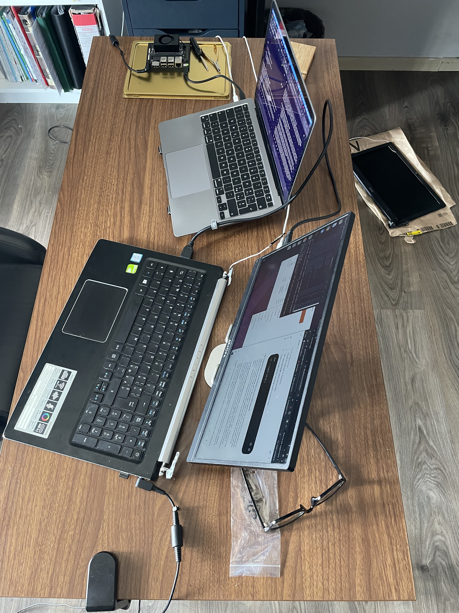
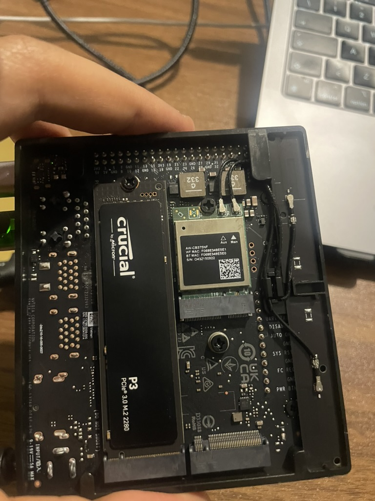

# Edge-VLA-Micro Developer Journal

This journal preserves hardware bring-up notes and the chronological engineering problem log for the Mac + Jetson edge deployment path. It intentionally excludes live demo runbooks, latest benchmark summaries, and architecture diagrams; those belong in [COMMANDS.md](COMMANDS.md), [README.md](README.md), and [ARCHITECTURE.md](ARCHITECTURE.md).

## Section 1: Hardware Setup Guide

### Target Environment

| Role | Hardware / OS | Purpose |
| --- | --- | --- |
| Target | NVIDIA Jetson Orin Nano Developer Kit 8GB, JetPack 6.x, NVMe | VLA/control runtime |
| Temporary host | x86_64 PC with native Ubuntu 22.04 | JetPack flashing through NVIDIA SDK Manager |
| Development client | Apple Silicon Mac | SSH development and sensor-node development |



### Why a Temporary Linux Host Is Required

NVIDIA SDK Manager is not compatible with macOS. Flashing JetPack and the bootloader requires a native Linux host with reliable USB passthrough. Virtual machines and WSL are not recommended for this step because USB recovery-mode enumeration and low-level flashing can fail.

The temporary Ubuntu host is only needed for flashing. After JetPack is installed on the Jetson NVMe drive, normal development happens from the Mac over SSH.

### Connection Diagram

```text
+---------------------------------------------------------+
|                    Router Wi-Fi                         |
+------------+-------------------------------+------------+
| (192.168.1.x)                 | (192.168.1.xxx)
        v                                v
+-----------------+             +-----------------+
|       Mac       |             | Jetson Orin Nano|
|    (Client)     |             |    (Target)     |
+--------+--------+             +--------+-------+|
         |                               |
         +--- High-speed USB-C data cable --+
Linux for Tegra interface
(IP: 192.168.55.100 <-> 192.168.55.1)
```

### Required Hardware

1. NVIDIA Jetson Orin Nano Developer Kit 8GB.
2. NVMe SSD, installed in the M.2 Key M slot below the carrier board module.
3. High-speed USB-C data cable. Charging-only cables are not sufficient.
4. Jumper, tweezers, or a conductive U-shaped clip for Force Recovery Mode.
5. Native Ubuntu 22.04 x86_64 host for SDK Manager.

If the temporary Ubuntu host has no stable Wi-Fi, use smartphone USB tethering to bring it online:

```bash
sudo apt update && sudo apt upgrade -y
sudo apt autoremove -y
```



### Install NVIDIA SDK Manager

Download NVIDIA SDK Manager from [NVIDIA Developer SDK Manager](https://developer.nvidia.com/sdk-manager).

On the Ubuntu host:

```bash
cd ~/Downloads
sudo apt install ./sdkmanager_*_amd64.deb
sdkmanager
```

Select:

- Target Hardware: `Jetson Orin Nano [8GB developer kit version]`.
- Target OS: JetPack 6.x / JetPack 6.2.2 when available.
- Host components: deselect unless needed.
- Target components: keep Jetson Linux, runtime components, CUDA, cuDNN, TensorRT, and OpenCV selected.
- Storage destination: NVMe.

### Force Recovery Mode

The USB-C data cable from the Ubuntu host must be connected to the Jetson native USB-C port. Do not connect it to the USB-A host ports.

Sequence:

1. Remove Jetson power.
2. Short Button Header pins 9 and 10 (`FC REC` and `GND`).
3. Keep the short in place and connect power.
4. Wait about 5 seconds after the green LED turns on.
5. Remove the short.

```text
   Conceptual Button Header pin map:
   +-----------------------------------------+
   |  o   o   o   o   o   o   o   [o]  [o]  o |  <- upper pin row
   |  1   2   3   4   5   6   7    9    10  11|
   |                              |    |     |
   |                              +----+-----+
   |                                Short (FCM)
   +-----------------------------------------+
```

Verify recovery mode on the Ubuntu host:

```bash
lsusb
```

Expected NVIDIA APX entry:

```text
Bus XXX Device YYY: ID 0955:7035 NVIDIA Corp.
```

### First Boot and Wi-Fi

After flashing, complete Ubuntu first boot on the Jetson and connect Wi-Fi with `nmcli`:

```bash
sudo nmcli device wifi connect "<WIFI_SSID>" password "<WIFI_PASSWORD>"
hostname -I
```

Expected addresses:

- `192.168.1.xxx`: Wi-Fi address from the router.
- `192.168.55.1`: static USB device-mode address on the Jetson.

### SSH from Mac

Test SSH:

```bash
ssh <JETSON_USER>@192.168.55.1
```

Recommended `~/.ssh/config` entries on the Mac:

```text
# Jetson Orin Nano - Direct USB-C connection
Host jetson-usb
    HostName 192.168.55.1
    User <JETSON_USER>

# Jetson Orin Nano - Local Wi-Fi network connection
Host jetson-wifi
    HostName 192.168.1.xxx
    User <JETSON_USER>
```

If VS Code Remote SSH shows a local-network route error, enable Visual Studio Code under macOS:

```text
System Settings -> Privacy & Security -> Local Network -> Visual Studio Code
```

Verify CUDA from the Jetson shell:

```bash
nvcc --version
```

Expected CUDA release for the tested environment:

```text
Cuda compilation tools, release 12.6
```

## Section 2: Software Problem Log

### 1. Jetson Network Failure: No NAT from USB

Symptom:

```text
apt update stalled
ping 1.1.1.1: 100% packet loss
default via 192.168.55.100 dev l4tbr0
wlP1p1s0 wifi disconnected
```

Diagnosis commands:

```bash
ip route
hostname -I
nmcli dev status
ping -c 3 1.1.1.1
ping -c 3 ports.ubuntu.com
```

Cause: the Jetson was connected to the Mac through USB device mode, but the Mac was not providing NAT. The Jetson Wi-Fi interface was disconnected.

Resolution:

```bash
nmcli device wifi rescan
nmcli device wifi list
sudo nmcli device wifi connect "<WIFI_SSID>" password "<WIFI_PASSWORD>"
sudo apt update
sudo apt install -y python3.10-venv python3-pip
```

### 2. Python Virtual Environment and User-Site Conflicts

Initial venv failure:

```text
The virtual environment was not created successfully because ensurepip is not available.
apt install python3.10-venv
```

Resolution:

```bash
sudo apt install -y python3.10-venv python3-pip
cd ~/Edge-VLA-Micro
rm -rf .venv-jetson
python3 -m venv .venv-jetson
source .venv-jetson/bin/activate
python -m pip install --upgrade pip
```

Validate that packages are installed inside the venv, not `~/.local`:

```bash
which python
which pip
python -m site
```

Expected:

```text
/home/ste/Edge-VLA-Micro/.venv-jetson/bin/python
/home/ste/Edge-VLA-Micro/.venv-jetson/bin/pip
ENABLE_USER_SITE: False
```

### 3. Wrong PyTorch Wheel

Symptom:

```text
torch: 2.12.0+cu130
cuda: 13.0
The NVIDIA driver on your system is too old
```

Cause: a generic/server CUDA wheel was installed instead of the Jetson-specific NVIDIA wheel.

Resolution: recreate the venv and install the NVIDIA JetPack wheel first:

```bash
python -m pip install --no-cache-dir \
  https://developer.download.nvidia.com/compute/redist/jp/v61/pytorch/torch-2.5.0a0+872d972e41.nv24.08.17622132-cp310-cp310-linux_aarch64.whl
```

Validation:

```bash
python - <<'PY'
import torch, transformers, numpy as np
print("torch:", torch.__version__)
print("torch path:", torch.__file__)
print("cuda available:", torch.cuda.is_available())
print("cuda:", torch.version.cuda)
print("transformers:", transformers.__version__)
print("numpy:", np.__version__)
PY
```

Observed stable baseline:

```text
torch: 2.5.0a0+872d972e41.nv24.08
cuda available: True
cuda: 12.6
```

### 4. Qwen2-VL FP16 OOM on Jetson UMA

The first VLM capacity test used `Qwen/Qwen2-VL-2B-Instruct` in FP16 with direct CUDA loading:

```bash
python scripts/jetson_baseline.py \
  --max-new-tokens 16 \
  --image-size 224
```

Constraints:

```text
device_map="cuda"
inputs.to("cuda")
torch.float16
```

Failure:

```text
NvMapMemAllocInternalTagged: ... error 12
NvMapMemHandleAlloc: error 0
MODEL_LOAD_FAILED
RuntimeError
CUDACachingAllocator.cpp:838
```

Conclusion: Qwen2-VL-2B FP16 exceeds the practical 8GB UMA budget once the OS, Python runtime, CUDA context, model, image processing, and control services are considered.

Engineering decision:

```text
Do not solve this with CPU/GPU offload on Jetson UMA.
Do not use device_map="auto".
Do not use max_memory or offload_folder.
Use a smaller model or a compiled/quantized runtime with native Jetson support.
```

### 5. AutoAWQ Failure on aarch64

`Qwen/Qwen2-VL-2B-Instruct-AWQ` was tested as a 4-bit mitigation path.

Intermediate issues:

- `numpy 2.2.6` was incompatible with modules compiled against NumPy 1.x.
- `datasets` and `zstandard` were missing.
- `transformers==4.46.3` lacked `transformers.models.qwen3`.
- Qwen2-VL processor required explicit `size`, `min_pixels`, and `max_pixels`.

Final environment:

```text
numpy: 1.24.4
transformers: 4.51.3
tokenizers: 0.21.4
autoawq: 0.2.9
```

Final runtime failure:

```text
Using naive (slow) implementation. No module named 'awq_ext'
RuntimeError: "rshift_cuda" not implemented for 'Half'
```

Conclusion: AWQ was not rejected because of memory. It was rejected because the AutoAWQ kernel/runtime path was not compatible with the tested Jetson aarch64/PyTorch stack. Installing generic Triton or server-grade CUDA wheels was not accepted because it risks replacing the NVIDIA Jetson runtime foundation.

### 6. SmolVLM Baseline Accepted

The stable Jetson VLM baseline is:

```text
HuggingFaceTB/SmolVLM-256M-Instruct
```

Command:

```bash
python scripts/jetson_smolvlm_baseline.py \
  --max-new-tokens 16 \
  --image-size 384
```

Observed result:

```text
RESULT
The image is a simple line drawing of a flight controller. The line is blue

elapsed_s: 2.51
tokens: 16
tps: 6.38
peak_cuda_allocated_gb: 0.60
```

Decision: SmolVLM-256M is the first real VLM baseline for Jetson. It runs single-device CUDA without offload and leaves memory headroom for the OS, OpenCV, FastAPI, MAVSDK, and telemetry.
