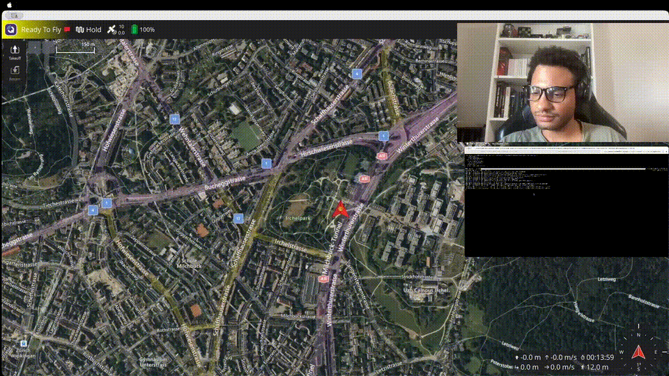
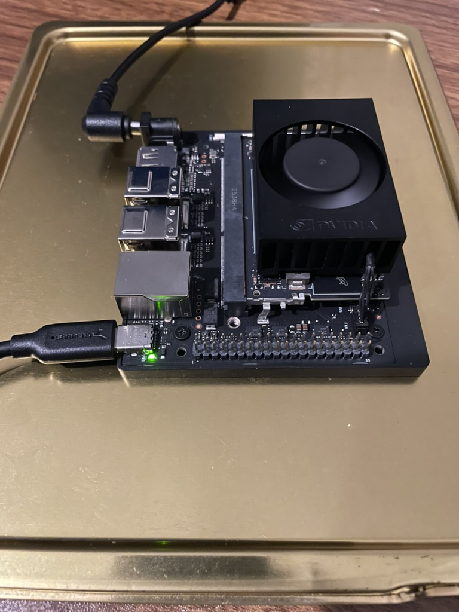
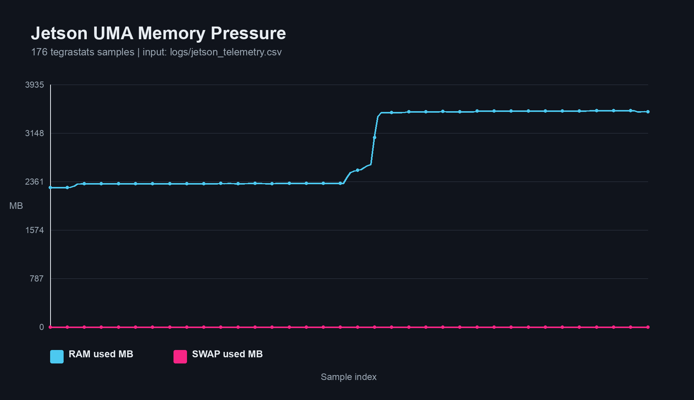
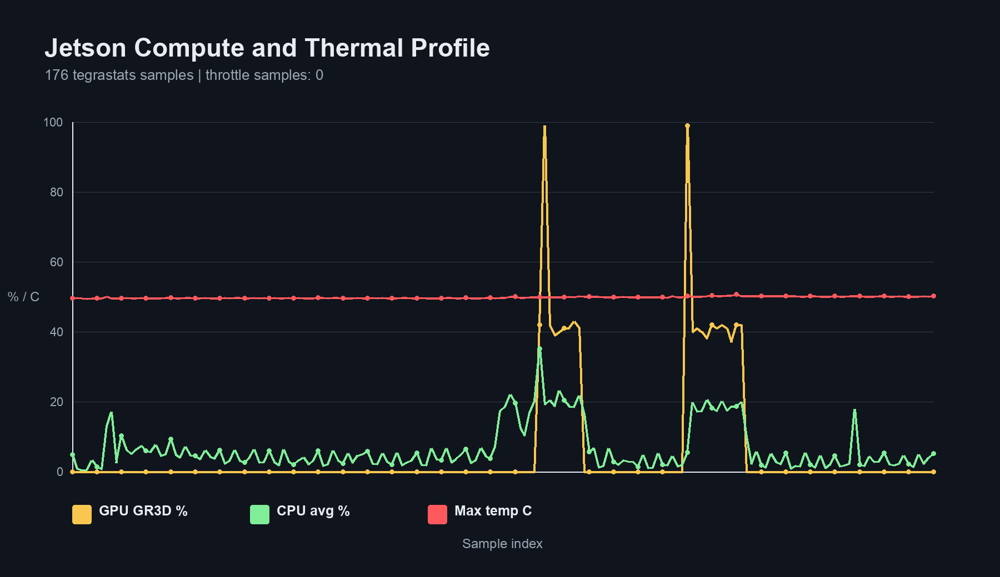
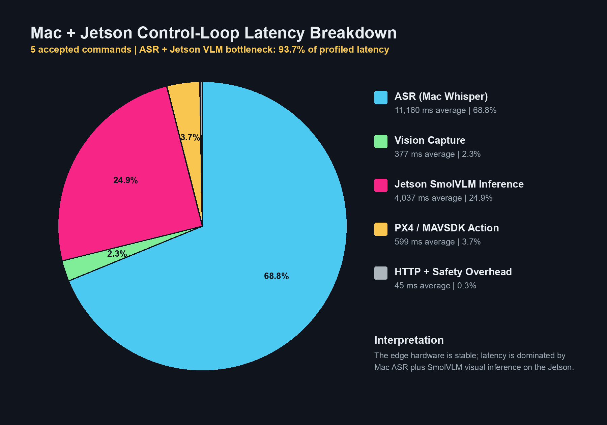
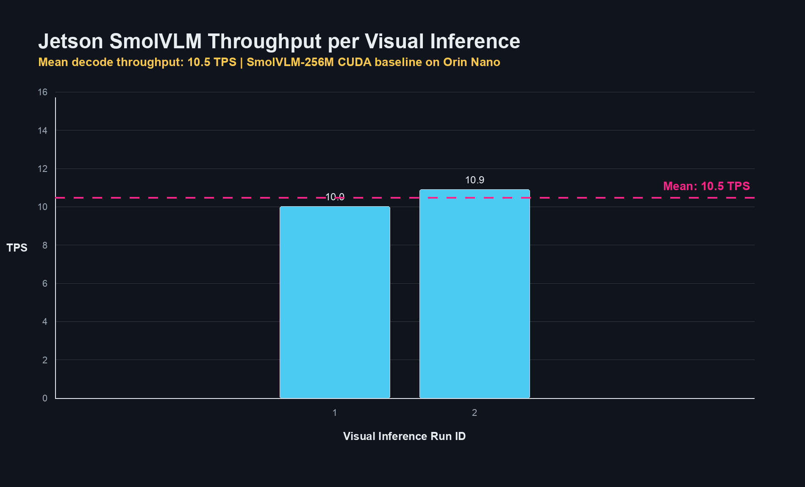

# Edge-VLA-Micro

Distributed Vision-Language-Action stack for PX4 drones running on Jetson Orin Nano.

Voice -> ASR -> Intent Router / VLM -> Safety Layer -> MAVSDK/PX4

Built for edge robotics under an 8GB memory budget.

[Demo Video](docs/imgs/vla-demo.mov)

## Why it matters

Most Vision-Language-Action systems require cloud inference or workstation-class GPUs. Edge-VLA-Micro demonstrates that a complete Voice-to-Action robotics pipeline can run on a Jetson Orin Nano while maintaining deterministic safety boundaries and PX4 integration.

## Key Results

| Metric | Result |
| --- | --- |
| Platform | Jetson Orin Nano 8GB |
| VLM | SmolVLM-256M |
| Peak RAM | 3.5 GB |
| Swap | 0 MB |
| GPU visual-inference peak | 99% |
| Peak temperature | 50.66 C |
| Thermal throttling | 0 suspected samples |
| Voice-to-Action | demonstrated |
| PX4 Integration | MAVSDK over MAVLink |
| Safety Layer | Pydantic + OpenCV guardrails + PX4 state rules |

## The Core Rule

The VLM is not a control authority. Perception proposes intent -> Safety authorizes -> Control executes.

In the distributed profile, the Mac is a smart sensor node: it runs ASR and sends text plus an optional camera frame. It does not authorize flight commands. The Jetson owns intent routing, SmolVLM inference when needed, deterministic safety validation, and MAVSDK dispatch. PX4 remains the final flight-stack authority.

Camera frames are not attached to every request by default. In `IMAGE_MODE=auto`, the Mac sends a 384 x 384 JPEG only for visual-grounding transcripts such as red/object/target/toward/follow/approach requests. Simple commands can take the Jetson text fast path without VLM inference.

## Optimization Strategy

Edge-VLA-Micro has two runtime profiles:

| Profile | Hardware | Purpose |
| --- | --- | --- |
| Local Mac-only | Apple Silicon Mac | Research-class VLM validation with Qwen2-VL over MLX |
| Edge distributed | Mac + Jetson Orin Nano | SWaP-constrained deployment with Mac as sensor node and Jetson as CUDA VLA/control engine |

The Mac profile can run larger Qwen2-VL MLX models for local spatial-reasoning validation. The Jetson profile runs SmolVLM to stay within the Orin Nano 8GB Unified Memory Architecture budget while preserving PX4/MAVLink control integration.

| Design choice | Naive baseline | Edge-VLA optimized path |
| --- | --- | --- |
| VLM size | Qwen2-VL 2B-class | SmolVLM 256M |
| Precision | FP16 | 4-bit / constrained edge runtime |
| Vision input | Full-resolution frame | cropped/downsampled frame |
| Runtime target | workstation-class GPU | Jetson Orin Nano 8GB |
| Safety | model-driven intent only | model proposal plus deterministic validation |

## Latency Profiler

The project includes an interactive technical profiler for comparing autonomy pipeline configurations:

[Open the Edge-VLA Autonomy Latency Profiler](https://blackhand01.github.io/Edge-VLA-Micro/)

The default profiler view contrasts a naive configuration against the optimized Edge-VLA path. It models ASR cost, image capture resolution, VLM parameter count, quantization, output token budget, Jetson memory bandwidth, TTFT, decode time, and safety overhead.

## Profile Comparison

| Mac-only latency breakdown | Mac-only VLM throughput |
| --- | --- |
|  |  |

| Mac + Jetson latency breakdown | Mac + Jetson SmolVLM throughput |
| --- | --- |
|  |  |

## Demo Evidence

Latest clean measured distributed run:

| Command | Result | Server latency |
| --- | --- | ---: |
| `Arm the drone.` | `arm` accepted | 1.05 s |
| `Take off!` | `takeoff` accepted | 1.72 s |
| `Move toward the red object.` | visual `move_velocity` | 17.52 s |
| `Move toward the red object.` | visual `move_velocity` | 11.81 s |
| `Move 1 meter per second.` | `move_velocity` fast path | 3.4 ms |

## Operations

All setup, demo, SITL, Jetson, monitoring, and reporting commands are centralized in [COMMANDS.md](COMMANDS.md).

## Documentation

- [ARCHITECTURE.md](ARCHITECTURE.md): system design, deployment profiles, data flow, model selection rationale, telemetry interpretation.
- [DEVELOPER_JOURNAL.md](DEVELOPER_JOURNAL.md): Jetson hardware setup, flashing guide, and chronological engineering problem log.
