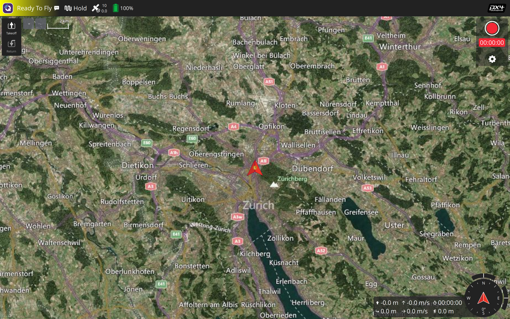

# Edge-VLA-Micro


Vision-Language-Action pipeline for PX4 SITL/HITL experiments: speech, camera, VLM reasoning, deterministic safety guards, and MAVSDK actuation.

<a href="docs/imgs/vla-edge.mov" target="_blank" rel="noopener noreferrer">
  
</a>

## Prerequisites

- Apple Silicon Mac for local prototyping, ASR, camera capture, PX4 SITL, and QGroundControl.
- NVIDIA Jetson Orin Nano 8GB with JetPack 6.x, CUDA-capable NVIDIA PyTorch, and the project copied to `~/Edge-VLA-Micro`.
- PX4 SITL with jMAVSim and QGroundControl available from this repository.
- USB-C or local network route between Mac and Jetson. The default Jetson USB device-mode address is `192.168.55.1`.

## Quickstart

Install dependencies for the host you are using:

```bash
make setup-mac
make setup-jetson
```

Run the local Mac-only profile:

```bash
make run-sitl
make run-qgc
make run-local
```

Run the distributed edge profile:

```bash
# Mac terminal 1
make run-sitl
```

In the PX4 `pxh>` shell, route MAVLink onboard traffic to the Jetson:

```bash
mavlink stop -u 14580
mavlink start -x -u 14580 -r 4000000 -m onboard -o 14540 -t 192.168.55.1
```

Then start the remaining services:

```bash
# Mac terminal 2
make run-qgc

# Jetson terminal
make run-edge-brain

# Mac terminal 3
make run-edge-sensor
```

Optional Jetson telemetry:

```bash
make monitor-jetson
make pull-jetson-logs
make charts-jetson
```

Primary runtime logs are written under `logs/`, including `logs/telemetry.csv`, `logs/performance.csv`, `logs/jetson_telemetry.csv`, and `logs/jetson_telemetry_summary.json`.

## Documentation

- [ARCHITECTURE.md](ARCHITECTURE.md): system design, deployment profiles, data flow, safety rationale, telemetry model.
- [DEVELOPER_JOURNAL.md](DEVELOPER_JOURNAL.md): Jetson hardware setup, flashing guide, network setup, and chronological problem log.

## Safety Note

Edge-VLA-Micro is a research and prototyping stack validated with PX4 SITL. The VLM never actuates directly: it proposes a JSON command, then deterministic Pydantic schemas, `CommandValidator`, visual guardrails, and PX4 state checks decide whether the command is safe to execute.
