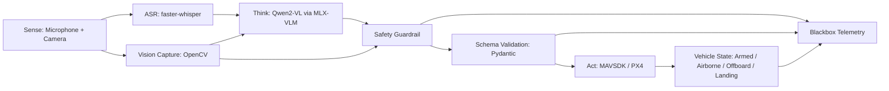
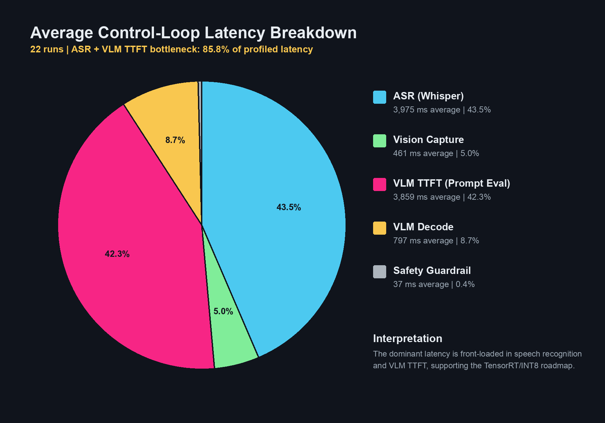
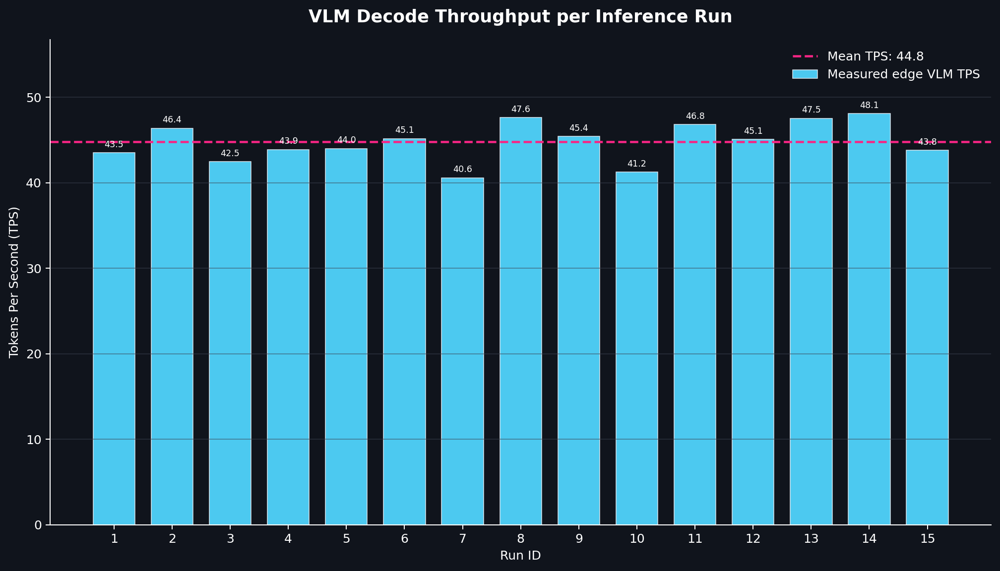

# Edge-VLA-Micro: Deterministic Vision-Language-Action Stack for Edge Autonomy


Edge-VLA-Micro is an asynchronous orchestration layer for edge autonomy that fuses probabilistic Vision-Language Model inference with deterministic flight-control constraints. The stack couples Qwen2-VL vision-language reasoning with MAVSDK/PX4 control primitives, while enforcing symbolic validation and computer-vision guardrails before actuation. It is designed for edge hardware where latency, safety fallbacks, and post-flight observability are first-class system requirements.

The current implementation has been validated against PX4 SITL with jMAVSim, QGroundControl, live ASR, OpenCV frame capture, MLX-VLM inference, MAVSDK command dispatch, blackbox telemetry, and per-run industrial latency logging.

## System Architecture



The flight loop is built on `asyncio`. Audio capture, camera capture, VLM inference, telemetry watchers, blackbox writes, and MAVSDK command dispatch are separated so slow inference does not block the flight-control surface.

For OFFBOARD motion, the controller maintains a MAVLink setpoint stream at 10 Hz (`0.1 s` period). This producer-consumer pattern keeps the PX4 control path alive while the VLM is processing a new command, preventing avoidable OFFBOARD failsafes caused by inference stalls. The cognition backend can run in a separate process to isolate MLX-VLM GPU behavior from the main async event loop.

Pipeline responsibilities:

- `main_agent.py`: async agent loop, ASR, vision routing, status output, fallback policy.
- `cognition_engine.py`: prompt construction, VLM inference, JSON extraction, HSV guardrail, schema repair, validation handoff.
- `command_validator.py`: Pydantic command schema, state-machine business rules, deterministic safety override.
- `drone_controller.py`: MAVSDK/PX4 control abstraction and OFFBOARD setpoint streaming.
- `telemetry_logger.py`: asynchronous blackbox and performance logging.

## Neuro-Symbolic Guardrail

Vision-Language Models are useful for mapping natural language into spatial intent, but they are not reliable flight-control authorities. In particular, they can exhibit spatial hallucination and prompt bleeding: the user says "move toward the red object", the prompt contains the word "red", and the VLM emits a plausible `move_velocity` command even when no red target is present in the frame.

Edge-VLA-Micro treats VLM output as an untrusted proposal. The proposal must pass two independent safety layers before actuation:

1. A deterministic OpenCV HSV hard-guard inspects the captured frame for requested color targets such as red or blue.
2. A strict Pydantic schema and symbolic state machine validate command shape, target evidence, kinematic bounds, battery policy, and allowed vehicle state transitions.

If the operator requests a visual target and the HSV detector cannot find the requested color, the system overrides the VLM proposal before validation:

```text
SAFETY_OVERRIDE: TARGET_NOT_FOUND
move_velocity -> hold
```

This prevents a catastrophic class of failures where an apparently valid velocity command is generated from a non-existent visual target. The guardrail is intentionally conservative: when target evidence is absent, the aircraft transitions to a safe HOLD behavior rather than trusting probabilistic language output.

The command schema requires every VLM command to include:

```json
{
  "command": "move_velocity",
  "target_found": true,
  "reasoning": "red object visible",
  "velocity_x": 0.5,
  "velocity_y": 0.0,
  "velocity_z": 0.0,
  "yaw_deg": 0.0
}
```

For non-visual commands such as `arm`, `takeoff`, `land`, and `hold`, the cognition layer can perform deterministic schema repair when the VLM omits target metadata. For motion commands, missing target evidence fails closed into HOLD.

## Performance Profiling and TensorRT Roadmap

The system was profiled on Apple Silicon UMA using per-token VLM instrumentation. The telemetry captures Time To First Token (TTFT), decode latency, generated token count, TPS, ASR time, vision capture time, safety validation time, and total loop latency in `logs/performance.csv`.

Observed averages from the current SITL run:

| Stage | Mean |
| --- | ---: |
| Audio ASR (Whisper) | ~4.0 s |
| Vision Capture | ~203 ms |
| VLM TTFT (Prompt Eval) | ~3.9 s |
| VLM Decode Throughput | ~45 TPS |
| Safety Guardrail (Pydantic + HSV) | ~11 ms |
| ASR + TTFT Bottleneck Share | ~87.5% |

The key systems result is that the symbolic safety layer is not the bottleneck. Pydantic validation plus HSV target gating completes in approximately 11 ms, while ASR and TTFT dominate the control cycle. This supports the architectural decision to preserve deterministic guardrails while focusing optimization work on model-serving latency.





### TensorRT Migration Target

The next deployment target is NVIDIA Jetson Orin Nano. The architecture is intentionally modular so that MLX-VLM can be replaced by a TensorRT-backed VLM runtime without changing the safety validator or MAVSDK control surface.

Roadmap objectives:

- Export or convert the selected VLM path into an optimized TensorRT engine.
- Quantize to INT8 where acceptable under validation tests.
- Reduce TTFT by moving prompt evaluation into a compiled GPU execution path.
- Preserve deterministic HSV/Pydantic guardrails as a post-inference authority layer.
- Drive end-to-end VLA cycle latency below 250 ms for responsive FPV autonomy.

## Blackbox Telemetry

Every VLM-backed decision can be recorded as a flight-recorder bundle under:

```text
logs/sessions/
```

Each bundle uses a shared timestamp and stores:

- A downsampled `.jpg` frame corresponding to the image seen by the VLM.
- A `.json` payload containing the prompt, raw VLM response, parsed JSON, validated command or rejection details, latency breakdown, safety profile, and kinematic drone state.
- The explicit model `reasoning` field and command trace needed for post-mortem analysis.

Disk writes are fire-and-forget async tasks. The logger uses background thread offload so blackbox recording does not add blocking disk I/O to the flight loop.

Per-run performance telemetry is appended to:

```text
logs/performance.csv
```

Whitepaper charts can be regenerated at any time:

```bash
python3 scripts/generate_charts.py --input logs/performance.csv --output-dir docs
```

## Quickstart and Deployment

### 1. Install Python Dependencies

Use the project virtual environment or the live demo environment:

```bash
python3 -m venv .venv
.venv/bin/python -m pip install --upgrade pip
.venv/bin/python -m pip install -r requirements.txt
```

For the existing live demo environment:

```bash
/tmp/edge-vla-live-venv/bin/python -m pip install -r requirements.txt
```

### 2. Terminal 1 - Start PX4 SITL with jMAVSim

From the repository root:

```bash
./scripts/run_jmavsim.sh
```

Wait until PX4 reports that the simulator is connected and ready for takeoff.

### 3. Terminal 2 - Start QGroundControl

```bash
./scripts/run_qgc.sh
```

Wait until QGroundControl displays the simulated vehicle and telemetry stream.

### 4. Terminal 3 - Verify Camera Input

Camera indices vary by machine and OBS/virtual-camera configuration. Before running the agent, verify the actual capture device:

```bash
/tmp/edge-vla-live-venv/bin/python vision_probe.py \
  --camera-index 1 \
  --frame-path tmp/probe_index1.jpg

open tmp/probe_index1.jpg
```

If the frame shows the OBS placeholder or a disabled-camera image, select a different `--camera-index` or fix the OBS virtual camera source before flying.

### 5. Terminal 3 - Start the Edge-VLA Agent

```bash
/tmp/edge-vla-live-venv/bin/python main_agent.py \
  --camera-index 1 \
  --whisper-model base.en \
  --whisper-language en \
  --silence-threshold 0.015 \
  --trailing-silence 0.6 \
  --max-record 3.0 \
  --cognition-backend process \
  --cognition-timeout 75 \
  --blackbox-dir logs/sessions \
  --performance-log logs/performance.csv
```

Expected terminal output:

```text
[STATE] AIRBORNE | [INPUT] Move toward the red object. | [ACTION] EXECUTED:move_velocity | [AUDIO_MS] ... | [VISION_MS] ... | [VLM_TTFT] ...ms | [VLM_TPS] ... | [SAFETY_MS] ... | [TOTAL_LATENCY] ...ms
```

Recommended command sequence:

```text
Arm the drone.
Take off.
Move toward the red object.
Move forward one meter per second.
Hold position.
Land.
```

Emergency keywords are monitored in the loop:

```text
stop
emergency
emergenza
```

### 6. Generate Whitepaper Charts

After collecting telemetry:

```bash
python3 scripts/generate_charts.py --input logs/performance.csv --output-dir docs
```

The script prints a Markdown-ready summary and writes:

```text
docs/latency_pie_chart.png
docs/tps_bar_chart.png
```

## Operational Safety Notes

This repository is a SITL-validated autonomy research stack, not a flight-certified avionics product. Real-world deployment requires hardware-in-the-loop testing, propeller-safe bench validation, geofencing, independent kill-switch authority, link-loss policy, and regulatory compliance review.

The core safety principle is that the VLM never acts directly. It proposes. The deterministic guardrail validates, overrides, or rejects.
