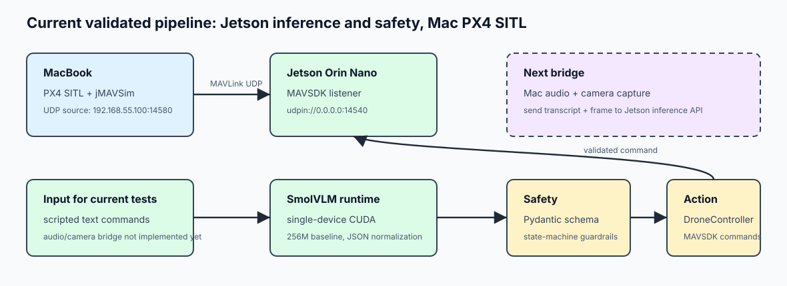

# Edge-VLA-Micro Jetson Porting Field Report

**File Name:** `docs/pt2_jetson-porting-field-report.md`
**Scope:** Porting operativo da Mac/MLX a NVIDIA Jetson Orin Nano 8GB  
**Target:** Jetson Orin Nano Developer Kit 8GB, JetPack 6.x bare-metal, Ubuntu 22.04, NVMe  
**Status:** Jetson smoke test end-to-end completato; SmolVLM validato come primo VLM reale CUDA



---

## 1. Obiettivo

Questo documento continua `docs/pt1_jetson-install-tutorial.md` e registra il percorso reale usato per portare `Edge-VLA-Micro` sulla Jetson Orin Nano.

L'obiettivo non era far girare subito il VLM completo, ma dimostrare progressivamente che:

1. la Jetson e' raggiungibile dal Mac;
2. CUDA e TensorRT sono presenti;
3. il repository gira su Linux/aarch64 senza MLX;
4. il backend cognitivo e' sostituibile;
5. MAVSDK sulla Jetson riceve MAVLink da PX4 SITL sul Mac;
6. la pipeline `intent -> cognition -> validation -> DroneController -> PX4` funziona end-to-end.

Risultato raggiunto: missione scripted SmolVLM completata con `arm -> takeoff -> hold -> land`, eseguita dalla Jetson verso PX4 SITL sul Mac. Il backend `dummy` era gia' stato validato anche sulla sequenza `move_velocity/OFFBOARD -> hold`.

---

## 2. Vincoli Hardware e Software

### 2.1 Jetson UMA

La Jetson Orin Nano usa una Unified Memory Architecture: CPU ARM e GPU Ampere condividono la stessa LPDDR5 fisica. Non esiste una VRAM separata come su una GPU discreta.

Regola adottata:

```text
Non usare offload artificiale CPU/GPU.
Non usare device_map="auto".
Non usare max_memory, --cuda-memory, --cpu-memory o offload_folder.
```

Motivo: questi parametri introducono una separazione artificiale tra CPU e GPU, possono peggiorare la latenza su UMA e possono attivare logiche Hugging Face/Accelerate pensate per server multi-GPU.

### 2.2 PyTorch NVIDIA per Jetson

La wheel usata e' quella NVIDIA aarch64 per JetPack:

```text
torch-2.5.0a0+872d972e41.nv24.08
CUDA 12.6
```

Questa build non include alcuni moduli distribuiti server-grade:

```text
torch.distributed.fsdp
torch._C._distributed_c10d
DeepSpeed/FSDP integrations
```

Regola adottata:

```text
Inference single-device only.
Niente FSDP, DeepSpeed o distributed checks.
```

### 2.3 Modello VLM

Il modello `Qwen/Qwen2-VL-2B-Instruct` in FP16 con caricamento diretto su CUDA e' stato testato, ma non entra stabilmente nel budget fisico della Orin Nano 8GB.

Errore osservato:

```text
NvMapMemAllocInternalTagged: ... error 12
NvMapMemHandleAlloc: error 0
RuntimeError: CUDACachingAllocator.cpp:838
```

Conclusione: Qwen2-VL-2B full FP16 e' utile come test di limite, non come runtime iniziale di deployment su Orin Nano 8GB.

---

## 3. Stato di Partenza

Dal tutorial di installazione erano gia' completati:

- flashing JetPack 6.x su NVMe;
- accesso SSH dal Mac alla Jetson via USB device mode;
- verifica CUDA;
- profilo prestazioni massimo.

Comandi verificati sulla Jetson:

```bash
ssh ste@192.168.55.1
nvcc --version
sudo nvpmodel -m 0
sudo jetson_clocks
```

CUDA rilevato:

```text
Cuda compilation tools, release 12.6
```

---

## 4. Sincronizzazione del Repository

Il codice e' stato copiato dal Mac alla Jetson con `rsync`, evitando ambiente virtuale, checkout pesanti e log non necessari.

Dal Mac:

```bash
cd ~/Desktop/Edge-VLA-Micro
REPO_ROOT="$PWD"

rsync -avh --progress \
  --exclude '.git/' \
  --exclude '.venv/' \
  --exclude '.venv-jetson/' \
  --exclude 'third_party/' \
  --exclude 'tmp/' \
  --exclude 'logs/sessions/' \
  --exclude '__pycache__/' \
  --exclude '.DS_Store' \
  --exclude 'docs/imgs/' \
  --exclude 'docs/index.html' \
  --exclude 'docs/personal-notes/probableQ&A-Interview.md' \
  "$REPO_ROOT/" \
  ste@192.168.55.1:~/Edge-VLA-Micro/
```

Esclusioni importanti:

- `.venv/`: ambiente Mac, non portabile su aarch64;
- `.venv-jetson/`: ambiente Jetson, va creato nativamente sulla Jetson;
- `third_party/`: PX4 checkout locale Mac;
- `logs/sessions/`: blackbox storici non necessari;
- `docs/imgs/`: asset docs pesanti, non servono sulla Jetson.

---

## 5. Primo Problema: Jetson Senza Internet

All'inizio `apt update` restava fermo e `pip`/`venv` non erano disponibili.

Diagnosi:

```bash
ip route
hostname -I
nmcli dev status
ping -c 3 1.1.1.1
ping -c 3 ports.ubuntu.com
```

Output rilevante:

```text
default via 192.168.55.100 dev l4tbr0
wlP1p1s0 wifi disconnected
ping 1.1.1.1: 100% packet loss
```

Interpretazione: la Jetson era collegata via USB al Mac, ma il Mac non stava facendo NAT. La Wi-Fi della Jetson era disconnessa.

Soluzione:

```bash
nmcli device wifi rescan
nmcli device wifi list
sudo nmcli device wifi connect "<SSID_WIFI>" password "<PASSWORD_WIFI>"
```

Poi:

```bash
sudo apt update
sudo apt install -y python3.10-venv python3-pip
```

---

## 6. Ambiente Python Jetson

### 6.1 Problema con `ensurepip`

Errore iniziale:

```text
The virtual environment was not created successfully because ensurepip is not available.
apt install python3.10-venv
```

Risolto installando:

```bash
sudo apt install -y python3.10-venv python3-pip
```

### 6.2 Creazione venv pulita

Sulla Jetson:

```bash
cd ~/Edge-VLA-Micro
rm -rf .venv-jetson
python3 -m venv .venv-jetson
source .venv-jetson/bin/activate
python -m pip install --upgrade pip
```

Verifica critica:

```bash
which python
which pip
python -m site
```

Output atteso:

```text
/home/ste/Edge-VLA-Micro/.venv-jetson/bin/python
/home/ste/Edge-VLA-Micro/.venv-jetson/bin/pip
ENABLE_USER_SITE: False
```

Motivo: in una fase precedente `pip` aveva installato pacchetti in `~/.local`, causando conflitti con `torch 2.12.0+cu130`. Quella build richiedeva driver CUDA 13 e falliva sulla Jetson CUDA 12.6.

Errore osservato:

```text
The NVIDIA driver on your system is too old
torch: 2.12.0+cu130
cuda: 13.0
```

Soluzione: ricreare la venv e assicurarsi che `USER_SITE` sia disabilitato.

---

## 7. Installazione PyTorch e Dipendenze Jetson

Installazione wheel NVIDIA:

```bash
python -m pip install --no-cache-dir \
  https://developer.download.nvidia.com/compute/redist/jp/v61/pytorch/torch-2.5.0a0+872d972e41.nv24.08.17622132-cp310-cp310-linux_aarch64.whl
```

Dipendenze principali:

```bash
python -m pip install --no-cache-dir \
  "transformers==4.51.3" \
  "accelerate>=0.34,<1" \
  "qwen-vl-utils>=0.0.14,<0.1" \
  "numpy>=1.24,<1.25" \
  "safetensors>=0.4,<1" \
  "sentencepiece>=0.2,<0.3" \
  "protobuf>=4,<5"
```

Dipendenze del repository:

```bash
python -m pip install --no-cache-dir -r requirements-jetson.txt
```

Verifica:

```bash
python - <<'PY'
import torch, transformers, numpy as np
print("torch:", torch.__version__)
print("torch path:", torch.__file__)
print("cuda available:", torch.cuda.is_available())
print("cuda:", torch.version.cuda)
print("transformers:", transformers.__version__)
print("numpy:", np.__version__)
from transformers import Qwen2VLForConditionalGeneration, AutoProcessor
print("Qwen2-VL imports ok")
PY
```

Output ottenuto:

```text
torch: 2.5.0a0+872d972e41.nv24.08
torch path: /home/ste/Edge-VLA-Micro/.venv-jetson/lib/python3.10/site-packages/torch/__init__.py
cuda available: True
cuda: 12.6
transformers: 4.51.3
numpy: 1.24.4
Qwen2-VL imports ok
```

---

## 8. Separazione Backend: MLX, Dummy, SmolVLM, TensorRT

Il repository originale usava MLX su Apple Silicon. MLX non puo' essere installato sulla Jetson.

Modifica architetturale introdotta:

```text
--vlm-backend auto|mlx|dummy|smolvlm|tensorrt
```

Backend:

- `mlx`: runtime Mac Apple Silicon;
- `dummy`: runtime deterministico per smoke test Jetson;
- `smolvlm`: runtime reale Hugging Face `HuggingFaceTB/SmolVLM-256M-Instruct` su CUDA Jetson;
- `tensorrt`: placeholder per runtime futuro;
- `auto`: Mac -> MLX, Linux/Jetson -> dummy.

File aggiunti/modificati:

- `src/perception/dummy_vlm_runtime.py`
- `src/perception/trt_vlm_runtime.py`
- `src/perception/smolvlm_runtime.py`
- `src/perception/cognition_engine.py`
- `src/perception/cognition_service.py`
- `src/core/cli.py`
- `requirements-jetson.txt`

Il contratto comune resta:

```python
generate_profiled(raw_prompt: str, *, image_path: str | None) -> tuple[str, VLMProfile]
```

Questo permette di sostituire la cognizione senza toccare:

- `CommandValidator`;
- guardrail HSV;
- `DroneController`;
- blackbox logging;
- loop async.

---

## 9. Baseline VLM: Qwen2-VL Full FP16 Non Entra


Script usato:

```bash
python scripts/jetson_baseline.py \
  --max-new-tokens 16 \
  --image-size 224
```

Vincolo applicato nello script:

```python
device_map="cuda"
inputs.to("cuda")
torch.float16
```

Risultato:

```text
Loading checkpoint shards: 50%
NvMapMemAllocInternalTagged: ... error 12
NvMapMemHandleAlloc: error 0
MODEL_LOAD_FAILED
RuntimeError
CUDACachingAllocator.cpp:838
```

Interpretazione:

```text
Qwen/Qwen2-VL-2B-Instruct FP16 direct CUDA load non entra stabilmente nella memoria fisica UMA disponibile.
```

Decisione:

```text
Non usare offload CPU/GPU.
Non forzare device_map="auto".
Passare a modello piu' piccolo, quantizzato, TensorRT/TensorRT-LLM o runtime 4-bit.
```

### 9.1 Qwen2-VL AWQ: Esperimento Scartato

E' stato provato anche `Qwen/Qwen2-VL-2B-Instruct-AWQ`, per verificare se la quantizzazione 4-bit potesse essere una soluzione immediata.

Problemi risolti durante il test:

- `numpy` era salito a `2.2.6`, incompatibile con moduli compilati contro NumPy 1.x;
- `datasets` e `zstandard` mancavano per AutoAWQ;
- `transformers==4.46.3` non conteneva il modulo `transformers.models.qwen3` richiesto dal percorso AutoAWQ;
- il processor Qwen2-VL richiedeva `size`, `min_pixels` e `max_pixels` espliciti.

Ambiente finale dell'esperimento:

```text
numpy: 1.24.4
transformers: 4.51.3
tokenizers: 0.21.4
autoawq: 0.2.9
```

Errore finale:

```text
Using naive (slow) implementation. No module named 'awq_ext'
RuntimeError: "rshift_cuda" not implemented for 'Half'
```

Conclusione:

```text
Qwen2-VL AWQ non e' stato scartato per memoria, ma per incompatibilita' runtime/kernel AutoAWQ sulla build PyTorch NVIDIA Jetson.
Non installare genericamente Triton o wheel CUDA server-grade su questa Jetson.
```

### 9.2 SmolVLM: Primo VLM Reale Accettato

Il primo modello VLM realmente validato su Jetson e':

```text
HuggingFaceTB/SmolVLM-256M-Instruct
```

Comando:

```bash
python scripts/jetson_smolvlm_baseline.py \
  --max-new-tokens 16 \
  --image-size 384
```

Risultato osservato:

```text
RESULT
The image is a simple line drawing of a flight controller. The line is blue

elapsed_s: 2.51
tokens: 16
tps: 6.38
peak_cuda_allocated_gb: 0.60
```

Decisione:

```text
SmolVLM-256M-Instruct diventa il baseline VLM reale per la pipeline Jetson.
Il modello gira single-device CUDA, senza offload e senza distributed/FSDP.
```

---

## 10. Validazione Cognition Dummy Senza MAVSDK

Dopo aver installato `pydantic`, e' stato validato il backend `dummy` direttamente sulla Jetson.

Comando:

```bash
python - <<'PY'
from src.perception.cognition_engine import CognitionEngine
from src.safety.command_validator import CommandValidator, DroneOperationalState, DroneStateSnapshot

tests = [
    ("Arm the drone.", DroneOperationalState.GROUNDED),
    ("Take off.", DroneOperationalState.ARMED),
    ("Hold position.", DroneOperationalState.AIRBORNE),
    ("Land.", DroneOperationalState.AIRBORNE),
]

for text, state in tests:
    engine = CognitionEngine(
        validator=CommandValidator(
            DroneStateSnapshot(state=state, connected=True, battery_remaining=1.0)
        ),
        vlm_backend="dummy",
        log_path="/tmp/edge-vla-dummy-cognition.log",
    )
    result = engine.process_intent(
        text,
        drone_state=DroneStateSnapshot(state=state, connected=True, battery_remaining=1.0),
    )
    print(text, state.value, "=>", result.ok, result.validated_command.name if result.ok else result.reason)
PY
```

Output atteso e ottenuto:

```text
Arm the drone. GROUNDED => True arm
Take off. ARMED => True takeoff
Hold position. AIRBORNE => True hold
Land. AIRBORNE => True land
```

Questo ha dimostrato:

- import del repo senza MLX;
- `CognitionEngine` funzionante;
- JSON parsing funzionante;
- Pydantic schema funzionante;
- state-machine validator funzionante.

---

## 11. Collegamento MAVLink Mac -> Jetson

### 11.1 PX4 sul Mac

Sul Mac:

```bash
cd ~/Desktop/Edge-VLA-Micro
./scripts/run_jmavsim.sh
```


PX4 ha mostrato:

```text
INFO [mavlink] mode: Onboard, data rate: 4000000 B/s on udp port 14580 remote port 14540
INFO [mavlink] MAVLink only on localhost
```

Per rendere esplicito il target Jetson sulla rete USB-C:

```text
pxh> mavlink stop -u 14580
pxh> mavlink start -x -u 14580 -r 4000000 -m onboard -o 14540 -t 192.168.55.1
```

Verifica raw UDP sulla Jetson:

```bash
python - <<'PY'
import socket
s = socket.socket(socket.AF_INET, socket.SOCK_DGRAM)
s.bind(("0.0.0.0", 14540))
s.settimeout(10)
print("waiting udp 14540...")
data, addr = s.recvfrom(2048)
print("got", len(data), "bytes from", addr)
PY
```

Output osservato:

```text
got 40 bytes from ('192.168.55.100', 14580)
```

### 11.2 Monitor heartbeat sulla Jetson

Comando:

```bash
python -m src.tools.heartbeat_monitor \
  --connection udpin://0.0.0.0:14540 \
  --cycles 5 \
  --timeout 30
```

Output ottenuto:

```text
[INFO] Opening MAVSDK connection on udpin://0.0.0.0:14540
[INFO] Waiting up to 30.0s for MAVLink heartbeat...
[INFO] Heartbeat received from PX4/MAVLink system.
[INFO] Waiting up to 30.0s for telemetry...
[INFO] Connected to drone. Status: DISARMED. Lat: 47.3977419 Lon: 8.5455940 Altitude: 0.0m Health: OK
```

Questo ha confermato:

```text
PX4 SITL sul Mac -> MAVLink UDP -> MAVSDK sulla Jetson
```

---

## 12. Smoke Test End-to-End con Backend Dummy e SmolVLM

Tool aggiunto:

```text
src/tools/scripted_agent_smoke.py
```

Scopo iniziale: evitare audio, camera e VLM pesante; testare solo la pipeline deterministica completa con backend `dummy`.

Scopo raggiunto dopo SmolVLM: usare lo stesso percorso `CognitionEngine -> CommandValidator -> DroneController -> PX4`, ma con un VLM reale su CUDA Jetson.

Comando sulla Jetson:

```bash
cd ~/Edge-VLA-Micro
source .venv-jetson/bin/activate

python -m src.tools.scripted_agent_smoke \
  --connection udpin://0.0.0.0:14540 \
  --vlm-backend smolvlm \
  --post-action-sleep 3 \
  --command "Arm the drone." \
  --command "Take off." \
  --command "Hold position." \
  --command "Land."
```

Sequenza validata:

```text
Arm the drone.
Take off.
Hold position.
Land.
```

Risultato osservato:

```text
[ACCEPTED] state=GROUNDED input='Arm the drone.' command=arm
INFO [src.action.drone_controller] Commanding arm
[ACCEPTED] state=ARMED input='Take off.' command=takeoff
INFO [src.action.drone_controller] Commanding takeoff
[ACCEPTED] state=AIRBORNE input='Hold position.' command=hold
INFO [src.action.drone_controller] Commanding hold
[ACCEPTED] state=AIRBORNE input='Land.' command=land
INFO [src.action.drone_controller] Commanding land
INFO [src.action.drone_controller] Vehicle landed
```

Warning osservato:

```text
Received ack for not-existing command: 176
```

Interpretazione: warning MAVSDK/PX4 non bloccante. La missione e' arrivata a `Vehicle landed`, quindi non e' stato trattato come failure.

Nota su SmolVLM: il modello piccolo puo' produrre JSON incompleto o campi non conformi. Per questo il runtime normalizza l'output in un JSON operativo minimo, poi il `CommandValidator` resta l'autorita' finale. Se un comando e' semanticamente incompatibile con lo stato corrente, viene comunque respinto.

---

## 13. Milestone Raggiunta

La milestone completata e':

```text
Mac:
  PX4 SITL + jMAVSim

Jetson:
  Edge-VLA-Micro
  MAVSDK client
  CognitionEngine
  SmolVLM VLM backend
  Pydantic safety validator
  DroneController

Risultato:
  arm -> takeoff -> hold -> land
  dummy gia' validato anche con move_velocity/OFFBOARD -> hold
```

Questa milestone dimostra che il porting non richiede un fork del repository: il cambio hardware resta confinato al runtime cognitivo.

---

## 14. Problemi Incontrati e Soluzioni

| Problema | Sintomo | Causa | Soluzione |
| --- | --- | --- | --- |
| Jetson senza internet | `apt update` fermo, `ping 1.1.1.1` fallisce | Solo link USB con Mac, niente NAT | Connessione Wi-Fi via `nmcli` |
| `python3 -m venv` fallisce | `ensurepip is not available` | `python3.10-venv` assente | `sudo apt install python3.10-venv python3-pip` |
| Pacchetti in `~/.local` | `Defaulting to user installation` | Venv non attiva o non scrivibile | Ricreare venv e verificare `ENABLE_USER_SITE: False` |
| Torch sbagliato | `torch 2.12.0+cu130`, driver too old | Wheel non Jetson, CUDA 13 | Usare wheel NVIDIA JetPack 6 CUDA 12.6 |
| Transformers/runtime HF | import distributed/FSDP o moduli mancanti | PyTorch Jetson non include stack server-grade | Patch single-device e runtime CUDA; ambiente finale `transformers==4.51.3` |
| Qwen2-VL full non carica | `NvMapMemAlloc error 12` | Modello FP16 troppo grande per UMA disponibile | Non usare offload; passare a modello piccolo/quantizzato/TensorRT |
| Qwen2-VL AWQ fallisce | `rshift_cuda not implemented for Half` | AutoAWQ senza kernel Jetson compatibile | Scartato come runtime; non installare Triton generico |
| SmolVLM JSON instabile | JSON troncato o campi extra | Modello piccolo non instruction-perfect | Normalizzazione runtime + validazione Pydantic/safety |
| MAVSDK muto | monitor fermo su heartbeat | PX4/MAVLink ancora su localhost o target non esplicito | `mavlink start ... -t 192.168.55.1`, raw UDP test, poi `heartbeat_monitor` |
| Comandi non validi in stato sbagliato | `VALIDATION_REJECTED` | State-machine corretta | Passare snapshot coerente: `GROUNDED -> ARMED -> AIRBORNE` |

---

## 15. Comandi di Verifica Rapida

Verifica CUDA/PyTorch:

```bash
python - <<'PY'
import torch
print(torch.__version__)
print(torch.cuda.is_available())
print(torch.version.cuda)
print(torch.cuda.get_device_name(0))
PY
```

Verifica repository:

```bash
python -m compileall src
```

Verifica heartbeat:

```bash
python -m src.tools.heartbeat_monitor \
  --connection udpin://0.0.0.0:14540 \
  --cycles 5 \
  --timeout 30
```

Verifica scripted mission:

```bash
python -m src.tools.scripted_agent_smoke \
  --connection udpin://0.0.0.0:14540 \
  --vlm-backend smolvlm \
  --post-action-sleep 3 \
  --command "Arm the drone." \
  --command "Take off." \
  --command "Hold position." \
  --command "Land."
```

Verifica solo cognizione SmolVLM, senza MAVSDK:

```bash
python -m src.tools.cognition_probe \
  --vlm-backend smolvlm \
  --state AIRBORNE \
  --text "Hold position." \
  --max-tokens 64
```

Verifica baseline modello:

```bash
python scripts/jetson_smolvlm_baseline.py \
  --max-new-tokens 16 \
  --image-size 384
```

Monitor risorse Jetson:

```bash
tegrastats --interval 1000
```

---

## 16. Stato Finale e Prossimi Step

Stato finale:

```text
Jetson Orin Nano bare-metal pronta.
Repository sincronizzato e importabile.
Backend dummy validato.
Backend SmolVLM validato.
MAVSDK Jetson riceve PX4 SITL dal Mac.
Missione scripted con SmolVLM completata fino a landing.
Qwen2-VL-2B FP16 documentato come non compatibile con 8GB UMA in direct CUDA.
Qwen2-VL-2B AWQ documentato come incompatibile con AutoAWQ su questa build Jetson: il modello arriva a inference startup, ma AutoAWQ ignora l'esclusione di lm_head, manca awq_ext e fallisce con rshift_cuda su Half.
SmolVLM-256M-Instruct validato come primo VLM reale su Jetson: single-device CUDA, image_size=384, max_new_tokens=16, elapsed=2.51s, TPS=6.38, peak CUDA allocated=0.60GB.
```

Prossimi step tecnici:

1. usare `scripted_agent_smoke --vlm-backend smolvlm` come test di regressione prima di ogni prova reale;
2. aggiungere il bridge Mac -> Jetson per inviare audio trascritto e frame immagine alla Jetson;
3. mantenere inferenza e controllo su Jetson, non sul Mac;
4. non proseguire con AutoAWQ su Jetson bare-metal senza un kernel nativo compatibile;
5. valutare GPTQ o TensorRT/TensorRT-LLM solo come esperimenti controllati, senza offload e senza sostituire la wheel NVIDIA di PyTorch;
6. mantenere invariati `CommandValidator`, `DroneController`, guardrail e blackbox;
7. aggiungere metriche Jetson a `logs/performance.csv` per ogni run SmolVLM reale.
